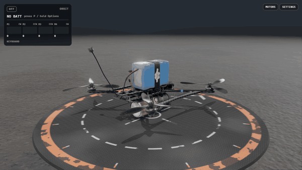

# PROPWASH

Open-source, browser-based FPV drone simulator built for realism. Three.js WebGPU + Web Audio.

**Live:** https://propwash-sim.vercel.app



> **Status: Phase 1, "Alive on the Bench," is complete.** Plug in the battery, hear the ESC tones, arm, and spool the props with procedural motor audio. Look through the FPV camera (analog or digital, with a Betaflight-style OSD) or the HD action cam, run the motor test, and use a keyboard, PS4/PS5 controller or USB RC radio. It does not fly yet; that's Phase 2. The acceptance checks are in [`docs/verification/`](docs/verification/README.md).

## Run it locally

Requires Node 20+ and pnpm.

```bash
pnpm i && pnpm assets && pnpm dev
```

`pnpm assets` builds `public/models/drone.glb` from the source model in `assets-src/` (split into animatable parts, rescaled to meters, meshopt + WebP compressed).

Click the page (or press any key) to start audio; browsers block sound until you interact.

## Controls

Keyboard, PS4 / PS5 controllers (Chrome's standard mapping) and USB RC radios all work, and you can switch between them at any time: throttle and sticks follow whichever device you touched last.

| Action                    | Keyboard                         | Gamepad (PS4 / PS5)                    |
| ------------------------- | -------------------------------- | -------------------------------------- |
| Plug / unplug battery     | P                                | Options (hold)                         |
| Arm / disarm              | Space                            | R1                                     |
| Kill                      | X                                | L1 + R1                                |
| Throttle                  | W / S (Shift = faster), 0 = zero | Left stick (Mode 2), or R2 in Settings |
| Yaw / pitch / roll        | A / D, arrow keys (not for acro) | Left stick X, right stick              |
| Flight mode               | Q (Acro / Angle / Horizon)       | L2                                     |
| Reset to launch pad       | R                                | D-pad down                             |
| Turtle mode (after crash) | T, then arm while upside down    | D-pad up                               |
| Cycle camera / feed style | C / V                            | Triangle / Square                      |
| Beacon                    | B                                | Circle                                 |
| Motor test panel          | M                                | Touchpad                               |
| Payload toggle            | L                                | Share / Create                         |
| Settings                  | O                                | —                                      |
| Hide UI / fullscreen      | H / F                            | —                                      |
| Orbit, zoom, pan          | Mouse drag, wheel, right-drag    | —                                      |

USB RC radios (EdgeTX / OpenTX in joystick mode) show up as non-standard gamepads. Press **Calibrate radio** in the input widget (bottom right) and the wizard detects each stick's axis, endpoints and direction, plus your arm switch. The calibration is saved in the browser. Controllers rumble in Chrome: the weak motor follows motor load, and the ESC tones and arming give short pulses.

## Roadmap

| Phase                     | Goal                                                                                                 |
| ------------------------- | ---------------------------------------------------------------------------------------------------- |
| **1. Alive on the Bench** | Power-up, ESC tones, arming, prop spool with blur, procedural motor audio, FPV + HD cameras with OSD |
| 2. Flight                 | 6-DoF physics at 500 Hz, Betaflight rates and PID sim, chase cam                                     |
| 3. World                  | Photoreal environments (terrain or Gaussian-splat captures)                                          |
| 4. Modes                  | Freestyle, race gates and ghosts, long-range with RSSI and GPS rescue                                |
| 5. Fidelity               | Recorded multi-RPM motor audio, real camera LUTs, crash physics                                      |
| 6. Desktop                | Tauri v2 app with native HID radio support                                                           |

The full spec is in [`docs/PRD.md`](docs/PRD.md).

## Contributing

See [CONTRIBUTING.md](CONTRIBUTING.md) and the [Code of Conduct](CODE_OF_CONDUCT.md).

## Credits

Code is [MIT](LICENSE). The drone model is based on "FPV-dron_NonStop" by [Viktor_](https://sketchfab.com/Viktor.Zhuravlev), [CC-BY-4.0](http://creativecommons.org/licenses/by/4.0/). Full attributions are in [CREDITS.md](CREDITS.md).
