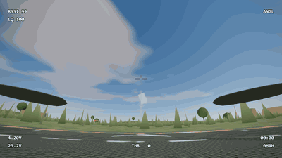
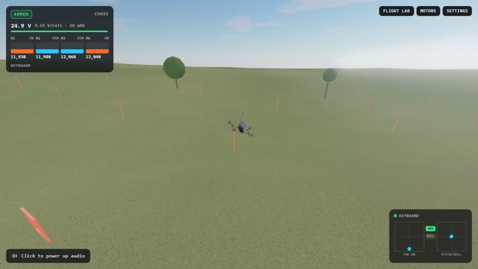
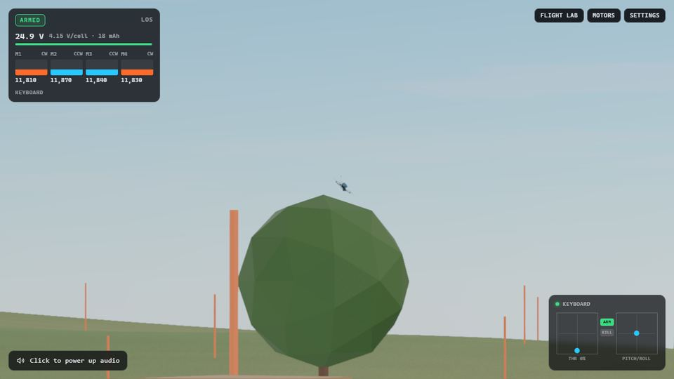
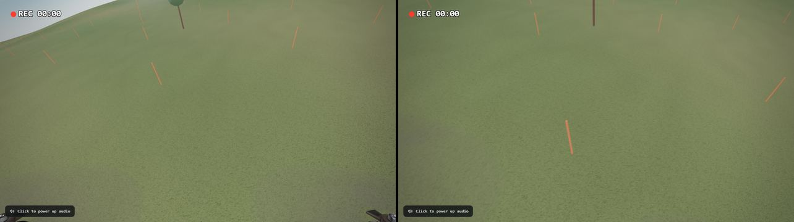

# PROPWASH

Open-source, browser-based FPV drone simulator built for realism. Three.js WebGPU + Web Audio.

**Live:** https://propwash-sim.vercel.app



> **Status: Phase 2, "Flight," is complete.** A 7″ quad flies on a 1 kHz rigid-body sim (Rapier) with every motor, prop, battery and aero force computed per step, through a Betaflight-faithful flight controller: Actual rates, RC smoothing, a physical-unit PID with I-term relax and feedforward, airmode, a gyro and accelerometer model, and Acro, Angle and Horizon modes. It lands, crashes, strikes props, flips back over in turtle mode and flies itself home in land mode. Prop wash shakes it on hard descents. Watch it through FPV, Chase, line-of-sight or a stabilized HD cam, replay any flight bit-identically, and read its blackbox in the Flight Lab (graphs, step response, Betaflight-style CSV, real-log import). The acceptance checks are in [`docs/verification/phase2.md`](docs/verification/phase2.md) and the measurements in the [Flight Lab report](docs/verification/flight-lab.md).

| Chase                                             | Line of sight                                      | HD horizon lock                                                    |
| ------------------------------------------------- | -------------------------------------------------- | ------------------------------------------------------------------ |
|  |  |  |

## Run it locally

Requires Node 20+ and pnpm.

```bash
pnpm i && pnpm assets && pnpm dev
```

`pnpm assets` builds `public/models/drone.glb` from the source model in `assets-src/` (split into animatable parts, rescaled to meters, meshopt + WebP compressed).

Click the page (or press any key) to start audio; browsers block sound until you interact.

URL options: `?airframe=freestyle7` (or `longrange7`, `longrange7_payload`), `?wind=calm|light|breezy`, `?quality=low|medium|high|ultra`, `?flight=0` for the Phase 1 bench.

## Flying

Press **P** to plug in the battery, then arm with **Space** at zero throttle. A radio or a gamepad's left stick is the throttle; the keyboard works (W/S, arrows, A/D) but isn't made for acro. **Q** switches Acro / Angle / Horizon; Angle is the easiest start. **G** flies the quad home and lands it where it armed. After a crash, **T** turns on turtle mode: arm while upside down and push the stick toward the side to lift. **R** puts it back on the pad.

Every flight is recorded from arming until 3 s after the disarm. **Y** replays it (resimulated from the seed and your inputs; the replay bar confirms it's bit-identical), with every camera, scrubbing, 0.25–2× speed and WebM export. **I** opens the Flight Lab: setpoint against gyro per axis and the motors, live or for the whole flight, the step response, CSV export with Betaflight `blackbox_decode` column names, and import of a real Betaflight log to fly it through the sim and compare.

## Controls

Keyboard, PS4 / PS5 controllers (Chrome's standard mapping) and USB RC radios all work, and you can switch between them at any time: throttle and sticks follow whichever device you touched last.

| Action                     | Keyboard                         | Gamepad (PS4 / PS5)                    |
| -------------------------- | -------------------------------- | -------------------------------------- |
| Plug / unplug battery      | P                                | Options (hold)                         |
| Arm / disarm               | Space                            | R1                                     |
| Kill                       | X                                | L1 + R1                                |
| Throttle                   | W / S (Shift = faster), 0 = zero | Left stick (Mode 2), or R2 in Settings |
| Yaw / pitch / roll         | A / D, arrow keys (not for acro) | Left stick X, right stick              |
| Flight mode                | Q (Acro / Angle / Horizon)       | L2                                     |
| Reset to launch pad        | R                                | D-pad down                             |
| Turtle mode (after crash)  | T, then arm while upside down    | D-pad up                               |
| Land mode (fly home, land) | G                                | Cross (✕)                              |
| Cycle camera / feed style  | C / V                            | Triangle / Square                      |
| HD stabilization           | K (raw / smooth / horizon lock)  | D-pad right                            |
| Replay the last flight     | Y (Space plays / pauses)         | D-pad left                             |
| Flight Lab (blackbox)      | I                                | —                                      |
| Beacon                     | B                                | Circle                                 |
| Motor test panel           | M                                | Touchpad                               |
| Payload toggle             | L                                | Share / Create                         |
| Settings                   | O                                | —                                      |
| Hide UI / fullscreen       | H / F                            | —                                      |
| Orbit, zoom, pan           | Mouse drag, wheel, right-drag    | —                                      |

USB RC radios (EdgeTX / OpenTX in joystick mode) show up as non-standard gamepads. Press **Calibrate radio** in the input widget (bottom right) and the wizard detects each stick's axis, endpoints and direction, plus your arm switch. The calibration is saved in the browser. Controllers rumble in Chrome: the weak motor follows motor load, and the ESC tones and arming give short pulses.

## Roadmap

| Phase                     | Goal                                                                                                 |
| ------------------------- | ---------------------------------------------------------------------------------------------------- |
| **1. Alive on the Bench** | Power-up, ESC tones, arming, prop spool with blur, procedural motor audio, FPV + HD cameras with OSD |
| **2. Flight**             | 6-DoF physics at 1 kHz, Betaflight-faithful FC, prop wash, test field, cameras, blackbox and replay  |
| 3. World                  | Photoreal environments (terrain or Gaussian-splat captures)                                          |
| 4. Modes                  | Freestyle, race gates and ghosts, long-range with RSSI and GPS rescue                                |
| 5. Fidelity               | Recorded multi-RPM motor audio, real camera LUTs, crash physics                                      |
| 6. Desktop                | Tauri v2 app with native HID radio support                                                           |

The specs are [`docs/PRD.md`](docs/PRD.md) (Phase 1) and [`docs/PRD-phase2-flight.md`](docs/PRD-phase2-flight.md); design choices and deviations are in [`docs/DECISIONS.md`](docs/DECISIONS.md), the module map in [`docs/ARCHITECTURE.md`](docs/ARCHITECTURE.md).

## Contributing

See [CONTRIBUTING.md](CONTRIBUTING.md) and the [Code of Conduct](CODE_OF_CONDUCT.md).

## Credits

Code is [MIT](LICENSE). The drone model is based on "FPV-dron_NonStop" by [Viktor_](https://sketchfab.com/Viktor.Zhuravlev), [CC-BY-4.0](http://creativecommons.org/licenses/by/4.0/). Full attributions are in [CREDITS.md](CREDITS.md).
