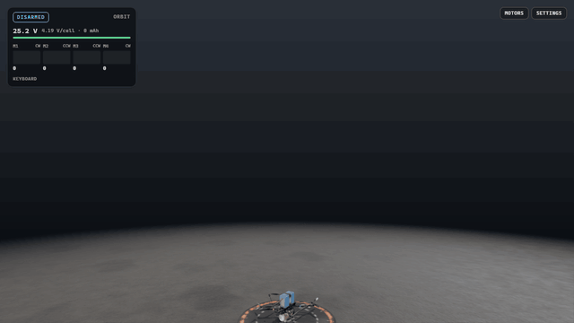

# Flight Lab: task group 1 (sim core)

Generated by `FLIGHT_LAB_REPORT=<file> pnpm vitest run tests/unit/flight.test.ts` (2026-09-25). Headless, deterministic, open loop (no flight controller yet), calm air unless noted. Each line gives the measurement, then the Phase 2 PRD target. Deviations and their reasons are in [DECISIONS.md](../DECISIONS.md) (2026-09-25).

- ω_max(25.2 V) = 2573 rad/s (24570 rpm) · PRD ≈ 2,573 rad/s ≈ 24,570 rpm
- static thrust at ω_max = 18.64 N per motor · PRD 18.6 N
-   freestyle7: T/W (static, 25.2 V) = 8.94 · PRD 8.9
-   longrange7: T/W (static, 25.2 V) = 5.63 · PRD 5.6
-   longrange7_payload: T/W (static, 25.2 V) = 4.61 · PRD 4.6
- T1 freestyle7: hover cmd 26.3% at 8218 rpm, 25.12 V · PRD ~26% (24–28%), ~8200 rpm
- T1 freestyle7: open loop at hover cmd, 10 s calm: altitude -1.63 m, vertical speed -0.118 m/s, horizontal drift 0.000 m, tilt 0.00°
- T1 longrange7: hover cmd 37.0% at 10356 rpm, 24.50 V · PRD ~36% (34–38%), ~10350 rpm
- T1 longrange7: open loop at hover cmd, 10 s calm: altitude -1.56 m, vertical speed -0.056 m/s, horizontal drift 0.000 m, tilt 0.00°
- T5 freestyle7: peak 7.05 g on the accelerometer (6.05 g net) at +111 ms · PRD 7–9 g
- T5 freestyle7: at 2 s 37.9 m/s (136 km/h), climbed 56.9 m · PRD ~40 m/s, ~60 m
- T5 freestyle7: pack 25.12 V at hover → 23.28 V minimum during the punch
- T5 longrange7: peak 3.37 g on the accelerometer (2.37 g net) at +87 ms · PRD 4–5 g
- T5 longrange7: at 2 s 23.5 m/s (85 km/h), climbed 30.1 m · PRD ~37 m/s, ~50 m
- T5 longrange7: pack 24.50 V at hover → 19.82 V minimum during the punch
- T6 freestyle7: level at 71.3° nose-down, 152 km/h (42.2 m/s), vertical -0.00 m/s, pack 22.50 V after 8 s · PRD 130–160 km/h
- T6 longrange7: level at 56.5° nose-down, 130 km/h (36.1 m/s), vertical -0.00 m/s, pack 19.74 V after 8 s · PRD 120–150 km/h
- T9 freestyle7: resting 25.20 V → 23.64 V at full throttle (126 A) → 22.34 V after 10 s (113 A, 327 mAh used)
- T9 freestyle7: V_loaded 2.86 V below the fresh pack after 10 s (1.30 V of it during the hold) · PRD ≥ 2.0 V
- T9 freestyle7: max RPM 24570 fresh → 23052 at the start → 21786 after 10 s (−11.3%) · PRD ≥ 6%
- T11: two 60 s runs (60,000 steps, Breezy gusts, seeded input log) identical: true · different seed differs: true · 0.0129 ms per step

