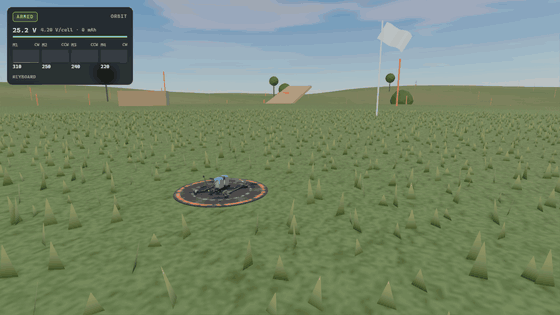
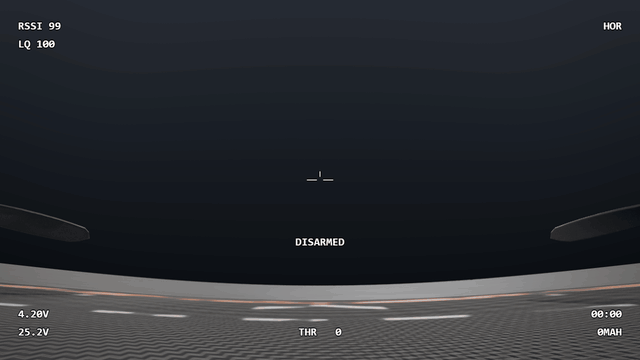

# Flight Lab

Generated by `FLIGHT_LAB_DIR=<dir> pnpm vitest run` (2026-09-25): headless and deterministic. Each line gives the measurement, then the Phase 2 PRD target. Deviations and their reasons are in [DECISIONS.md](../DECISIONS.md) (2026-09-25).

## Group 4: prop wash, land mode, visual and audio coupling

Prop wash (§2.4), freestyle7 at 120 m, calm air. The gyro's 10–40 Hz band is measured as the FC sees it; the punch is flown in Acro, where nothing self-levels the wobble away.

- T8: clean hover 10–40 Hz gyro RMS 0.08°/s · descent reached -7.0 m/s · 60% punch through the wash: 9.17°/s (×120.9), wash severity up to 1.00, attitude wobble ±3.0° · PRD ≥ 3×, visible wobble
- T8 control, prop wash off: punch 0.07°/s (×1.0 hover), wobble ±0.1°: the rise comes from the wash model
- T8: same descent while moving 8.0 m/s horizontally: wash severity up to 0.00

Land mode (G / ✕): from 39 m out and 12 m up, the autopilot climbs, flies home facing it, descends and disarms on touchdown.

- Land mode (calm): from 39 m out and 12 m up, home in 10.0 s · landed 0.27 m from where it armed, tilt 0.9° · max tilt en route 41°, max height 12.0 m
- Land mode (light): from 39 m out and 12 m up, home in 10.1 s · landed 0.45 m from where it armed, tilt 0.0° · max tilt en route 41°, max height 12.0 m

## Group 3: test field, landing, crash, turtle

The §5 test field and the §5 drone colliders, freestyle7, calm air.

- Field: 600 m square, 200² cells, heights -8.7 to 7.9 m, flat launch area y = 0 · 908 object colliders (6 gates) · collider vs render surface: worst 0.00 mm over 200 points
- Rest on the pad: model origin y -0.0472 m, tilt 0.00°, on ground true, prop strike false
- T12: touchdown at -0.86 m/s · bounce 0.00 cm · at rest: tilt 0.00°, 0.07 m from the pad centre, on ground true · disarm: 2528 rpm → 832 after 1 s → 90 after 3 s · PRD upright, bounce < 3 cm, spools down
- T13: upside down (resting at 142° on the battery) on grass · 80% roll stick in turtle: the right motors spin in reverse to -12420 rpm · upright (tilt < 35° on the ground) after 622 ms · settled at 0.0° · PRD < 2 s
- T13: other directions at 80%: roll left 612 ms, pitch forward 695 ms, pitch back 697 ms
- Impacts: 3 m drop, tilted 60°: peak contact 835 g · prop strike true

## Group 2: flight controller

The Betaflight-style controller flying the §2 physics, sensor model on (noise, vibration, filters) unless noted. freestyle7, calm air.

- T10: +roll stick → roll rate 46°/s (right) · +pitch → 45°/s (nose down) · +yaw → 44°/s (nose right)
- T10: hover, centred sticks, 3 s: equal motor thrust 2.080/2.080/2.080/2.080 N · peak body rate 0.87°/s · attitude roll -0.28°, pitch 0.17°
- T2 roll: 90% rise 110 ms (from the stick step, RC smoothing included), overshoot 0.6%, worst error after 250 ms ±6.4% · PRD 70–110 ms, < 10%, ±2%
- T2 roll: error 250–300 ms ±5.5% (before the roll passes 150°)
- T2 pitch: 90% rise 110 ms (from the stick step, RC smoothing included), overshoot 0.6%, worst error after 250 ms ±6.4% · PRD 70–110 ms, < 10%, ±2%
- T2 pitch: error 250–300 ms ±5.4% (before the roll passes 150°)
- T3 yaw: 90% at 26 ms, 98% at 28 ms, overshoot 7.2% · PRD reached < 250 ms, overshoot < 12%
- T4: 360° in 622 ms (full stick = 670°/s) · overshoot past 360° 32.0°, bounce-back 0.00°, settled at 392.0° · PRD 0.55–0.75 s, bounce < 5°
- T7: peak roll rate 25.2°/s, max roll 0.80° · back under 2°/s 89 ms after the impulse ended (139 ms after it began) · PRD < 150 ms
- T1 freestyle7 (Angle, 30 s, ideal sensors): horizontal drift 0.042 m, yaw drift 0.00°, max tilt 0.10°, altitude -9.6 m at fixed throttle · PRD < 0.5 m, < 2°
- T1 longrange7 (Angle, 30 s, ideal sensors): horizontal drift 0.039 m, yaw drift 0.00°, max tilt 0.09°, altitude -6.1 m at fixed throttle · PRD < 0.5 m, < 2°
- T1 freestyle7 (Angle, 30 s, sensor model on): horizontal drift 1.408 m, yaw drift 0.13°, max tilt 0.29°, altitude -9.2 m at fixed throttle · PRD < 0.5 m, < 2°
- T1 longrange7 (Angle, 30 s, sensor model on): horizontal drift 1.328 m, yaw drift 0.13°, max tilt 0.32°, altitude -5.8 m at fixed throttle · PRD < 0.5 m, < 2°

## Group 1: sim core

Open loop (no flight controller), calm air unless noted.

- ω_max(25.2 V) = 2573 rad/s (24570 rpm) · PRD ≈ 2,573 rad/s ≈ 24,570 rpm
- static thrust at ω_max = 18.64 N per motor · PRD 18.6 N
-   freestyle7: T/W (static, 25.2 V) = 8.94 · PRD 8.9
-   longrange7: T/W (static, 25.2 V) = 5.63 · PRD 5.6
-   longrange7_payload: T/W (static, 25.2 V) = 4.61 · PRD 4.6
- T1 freestyle7: hover cmd 26.3% at 8218 rpm, 25.12 V · PRD ~26% (24–28%), ~8200 rpm
- T1 freestyle7: open loop at hover cmd, 10 s calm: altitude -1.63 m, vertical speed -0.118 m/s, horizontal drift 0.000 m, tilt 0.00°
- T1 longrange7: hover cmd 37.0% at 10356 rpm, 24.50 V · PRD ~36% (34–38%), ~10350 rpm
- T1 longrange7: open loop at hover cmd, 10 s calm: altitude -1.56 m, vertical speed -0.056 m/s, horizontal drift 0.000 m, tilt 0.00°
- T5 freestyle7: peak 7.05 g on the accelerometer (6.05 g net) at +111 ms · PRD 7–9 g
- T5 freestyle7: at 2 s 37.9 m/s (136 km/h), climbed 56.9 m · PRD ~40 m/s, ~60 m
- T5 freestyle7: pack 25.12 V at hover → 23.28 V minimum during the punch
- T5 longrange7: peak 3.37 g on the accelerometer (2.37 g net) at +87 ms · PRD 4–5 g
- T5 longrange7: at 2 s 23.5 m/s (85 km/h), climbed 30.1 m · PRD ~37 m/s, ~50 m
- T5 longrange7: pack 24.50 V at hover → 19.82 V minimum during the punch
- T6 freestyle7: level at 71.3° nose-down, 152 km/h (42.2 m/s), vertical -0.00 m/s, pack 22.50 V after 8 s · PRD 130–160 km/h
- T6 longrange7: level at 56.5° nose-down, 130 km/h (36.1 m/s), vertical -0.00 m/s, pack 19.74 V after 8 s · PRD 120–150 km/h
- T9 freestyle7: resting 25.20 V → 23.64 V at full throttle (126 A) → 22.34 V after 10 s (113 A, 327 mAh used)
- T9 freestyle7: V_loaded 2.86 V below the fresh pack after 10 s (1.30 V of it during the hold) · PRD ≥ 2.0 V
- T9 freestyle7: max RPM 24570 fresh → 23052 at the start → 21786 after 10 s (−11.3%) · PRD ≥ 6%
- T11: two 60 s runs (60,000 steps, Breezy gusts, seeded input log) identical: true · different seed differs: true · 0.0280 ms per step

